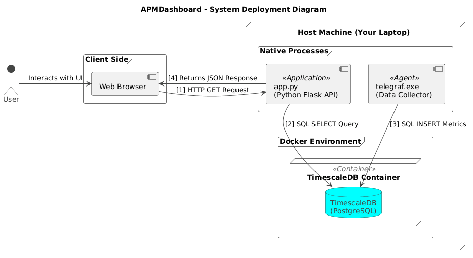

# Real-Time Application Performance Monitoring (APM) Dashboard

A full-stack case study project developed to demonstrate a complete data pipeline for monitoring real-time system metrics. This repository contains the source code, configuration, and documentation for the project.

---

## 1. Project Overview

This project implements a lightweight Application Performance Monitoring (APM) system from the ground up. The primary goal is to simulate a professional monitoring environment by continuously collecting system metrics (CPU and memory usage) and application health, storing this time-series data efficiently, and visualizing it on a multi-panel, custom-built, real-time web dashboard.

The architecture was designed to be modular, scalable, and utilize industry-standard open-source tools. It serves as a practical demonstration of handling time-series data, building a backend API, and creating a dynamic frontend visualization.

---

## 2. System Architecture

The data flows through a four-stage pipeline, from collection to visualization. Each component is decoupled, making the system robust and easy to maintain.



1.  **Data Ingestion (Telegraf):** A server agent that collects metrics from the host system at a regular interval.
2.  **Database (TimescaleDB on Docker):** A PostgreSQL database extended with TimescaleDB for efficient time-series data storage and querying. It runs in a Docker container for portability.
3.  **Backend API (Python & Flask):** A lightweight web server that exposes JSON API endpoints. It queries the database for recent data when requested by the frontend.
4.  **Frontend (HTML, JS, Chart.js):** A static, client-side webpage that periodically fetches data from the backend API and renders it as multiple live charts and status panels.

---

## 3. Technology Stack

This project integrates several key technologies from different areas of software development:

| Category          | Technology                               | Purpose                                      |
| ----------------- | ---------------------------------------- | -------------------------------------------- |
| **Data Ingestion**| Telegraf                                 | Collecting system metrics (CPU, Memory).     |
| **Database** | PostgreSQL with TimescaleDB              | Storing and querying time-series data.       |
| **Backend** | Python 3, Flask, psycopg2                | Creating the data API to serve JSON.         |
| **Frontend** | HTML5, CSS3, JavaScript (ES6)            | Structuring and styling the web dashboard.   |
| **Visualization** | Chart.js                                 | Rendering the real-time line graph.          |
| **Infrastructure**| Docker                                   | Containerizing the database service.         |
| **DB Management** | DBeaver                                  | GUI for direct database inspection and query.|

---

## 4. Final Dashboard

The final output is a clean, multi-panel web dashboard that visualizes the collected CPU usage, memory usage, and the live status of a target application.


---

## 5. Setup and Installation

Follow these steps to run the project locally.

### Prerequisites

* [Docker](https://www.docker.com/products/docker-desktop/)
* [Python 3](https://www.python.org/downloads/)
* [Telegraf](https://portal.influxdata.com/downloads/)

### Step 1: Start the Database
Open a terminal and run the TimescaleDB Docker container. Replace `your_password` with a secure password.

```bash
docker run -d --name timescaledb -p 5432:5432 -e POSTGRES_PASSWORD=your_password timescale/timescaledb:latest-pg14
````

### Step 2: Configure and Start the Data Collector

1.  Ensure the `telegraf.conf` file in this repository is configured with the correct database password.
2.  Open a new terminal **as an administrator** and run the Telegraf agent.

```bash
# Navigate to your Telegraf installation directory
cd C:\Telegraf\

# Run Telegraf with the project's configuration file
.\telegraf.exe --config path/to/this/project/telegraf.conf
```

### Step 3: Start the Backend API Server

1.  Navigate to the `backend` directory of this project.
2.  Install the required Python libraries.

```bash
pip install -r requirements.txt
```

3.  Run the Flask server.

```bash
python app.py
```

The server will be running on `http://127.0.0.1:5000`.

### Step 4: View the Dashboard

Navigate to the `frontend` directory and open the `index.html` file in your preferred web browser. The chart will load automatically.

---

## 6. API Endpoints

The backend provides three API endpoints to serve data to the frontend.

### `GET /api/cpu-data`

* **Description:** Retrieves the last 10 minutes of `usage_user` CPU data.
* **Response:** A JSON array of objects.

### `GET /api/mem-data`

* **Description:** Retrieves the last 10 minutes of `used_percent` memory data.
* **Response:** A JSON array of objects.

### `GET /api/check-port/<port>`

* **Description:** Performs a live health check on a given port on `localhost` to see if a service is running. This is used for the interactive health check panel.
* **Response:** A JSON object indicating the status.
* **Sample Response (Success):**
    ```json
    {
        "status": 200,
        "port": 5000,
        "message": "OK"
    }
    ```
* **Sample Response (Failure):**
    ```json
    {
        "status": 503,
        "port": 3000,
        "message": "Service Unavailable"
    }
    ```

---

## 7. Key Learnings and Optimizations

Throughout this project, several key challenges and optimizations were addressed:

* **Handling High-Frequency Data:** The initial implementation collected data every second and sent all raw points to the frontend. This created a visually "noisy" and jagged chart that was difficult to interpret.

* **Solution: Backend Aggregation:** To solve this, the backend API was optimized. Instead of querying raw data, the SQL query was updated to use TimescaleDB's `time_bucket_gapfill()` function. This aggregates the 1-second data into cleaner 5-second averages directly in the database. This is a common and highly efficient technique in real-world time-series applications, as it reduces the amount of data sent over the network and makes the visualization much clearer.

* **Live Health Checks:** The application status panel was improved from simply reading historical data to performing a live, dynamic health check via a socket connection in the Python backend. This demonstrates a more robust and immediate failure detection mechanism.
